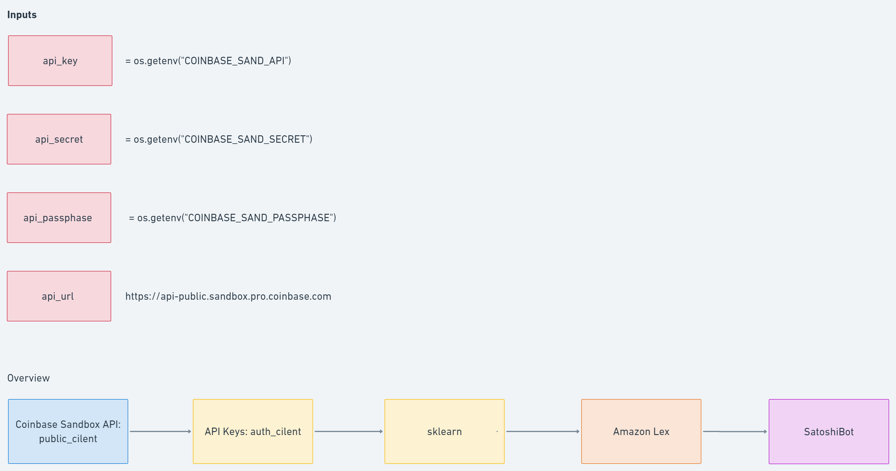
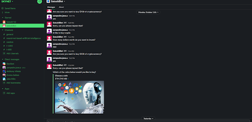

# Fintech Bootcamp Project 2: Algorithmic Cryptocurrency Trading Bot

## **Group 5:**

Julia Milin 
Jose Sampedro 
Donna Salinas 
Anthony Mirete 

## **Project Overview:**

As new investors learn more about the world of cryptocurrency, oftentimes than not, it can be an information overload when it comes to selecting a coin to invest in. The overall idea for this project is to create an A.I chat training bot to help new traders with the overall concept of trading and encourage new users to create their own trading strategies. Through Amazon Lex, this robo-advisor will buy and sell cryptocurrency orders using simulated trading. We use the Sandbox API to retrieve fundamental data (market cap, volume, circulating supply, total supply, and other relevant information) for the bitcoin (BTC). 

## **Research Questions:**

During the early planning stages, we came up with the following questions to build and set an overall foundation for the project. 

1. What messages to display and what information from the trader is needed for the robo-advisor?
2. What cryptocurrency fundamentals will be used (market cap, volume, supply, volatility, close and open price (daily, weekly, monthly)?
3. How detailed will this project be? How will it be organized? 

## **Data Collection:**

We will be using Sandbox APIs to fetch the information for supply for this project. We will set up the Amazon Lex to look like a dashboard and will use pandas for data frames to display the information provided by the API. 

**Libraries Utilized:**

- Pandas - Python library and data cleaning
- NumPy - Calculations
- hvPlot - Visual graphics
- sklearn - Supervised learning algorithm 

***Image 1: Generalized Overview of the Algorithmic Cryptocurrency Trading Bot***

The Algorithmic Cryptocurrency Trading Bot works overall is like the following:

The goal of this project is to create a simulated trading robo-advisor. First, we use the Coinbase Sandbox API as the test environment. Using machine learning libraries such as skit-learn to take in data from the API, the machine model analyzes the strategy signals (slow and fast moving averages) to indicate a change in price. Then we create a robo-advisor using Amazon Lex and we then program the robo-advisor to buy or sell orders via the platform Slack.

## **Model Performance:**

**Scikit Learn Supervised Machine Learning**

The trading strategy I used made a .64% return using BTC-USD.  I used rolling windows of 25 and 100.  I could have made more money if I used smaller rolling windows, resulting in more trades, but the data did not make great predictions.  I made better predictions with the larger window.

***Image 2: Cumulative Returns for Rolling Windows of 25 and 100***

Model Performance.  I used a SVM model and a Decision Tree model.  I tested about 5 models, which did not perform as well as SVM and DecisionTree. For this algorithm, it was important to use a classifier model to predict 1 of 2 outcomes, the trading signal: 1 or -1

***Image 3: Decision Tree Model***

The SVM model did not perform as well.

***Image 4: SVM Model***

Overall I am very happy with the results from the Decision Tree model.  I would like more time to optimize it before using testing it will real money.

## **Interactive Trading Bot User Inteface:**

**Amazon Lex**

Amazon Lex is service that will be used to build an A.I trading training bot also known as a conversational interface to interact with new traders. With Lex, we can create custom slots types and define values to be used as part of the intent for the bot.

**SatoshiBot**

The bot for our program is called SatoshiBot. It is a roboadvisor that is able to buy and sell cryptocurrency orders via simulated trading using data from Coinbase Sandbox API.

Sample Questions for SatoshiBot:

1. Which cryptocurrency would you like to put on your watchlist {coin}?
2. How many dollars worth of {coin} do you want to invest?
3. How many dollars worth of {coin} do you want to sell?

***Image 5: SatoshiBot via Slack***

## **Overall Comments:**

**Modifications I want to complete**

If I had more time, I want to create an optimize a neural network model using Keras.  

The problem I am facing regarding the last for loop and if else statements is:  I am running a for loop to loop through all the predicted signals, but since I am using a binary classifier model, I can only use 2 signals 1 and -1.  I tried running it with 3 signals 1, -1, 0, but I was not able to find a good enough multiclass model to predict the signals in the time allotted to me.  What is happening is that those signals are causing the program to buy every single day, when it should be holding.  I want the bot to hold if the previous row is the same as the last one.  I am working to solve this problem.

Once I am able to solve the last function, the bot will trade live on the Coinbase sandbox, and I will be able to optimize the code to buy and sell more often for better cumulative returns.  Until that is done, I am using print statements to test.

